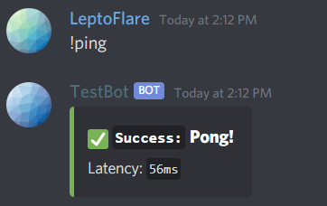

# `blurple.py`
> A front-end framework for discord.py

[![PyPI][pypi-shield]](https://pypi.org/project/blurple.py)
![License][license-shield]
![Stars][stars-shield]
#

Blurple.py is a framework built on top of discord.py, giving you the tools you need to build discord bots with convenience.

Here's what's included:
1. `blurple.ui` All the styled components you'll ever need for building user interfaces in discord.
    - Planned support for modals and more in the future, using discord's new api.
2. `blurple.io` Robust functions that enable you to build stable, multi-step commands with ease.
    - Support for multi-event replies, and timeout handling by default.
3. `blurple.ext` Utilities and sane defaults for discord.ext commands.
    - An unopinionated drop-in replacement for the builtin help command.
    - A minimal, route-based microframework for registering commands.

## Usage <!-- Using the product -->
_Documentation can be found [here](https://lepto.tech/blurple.py)._

### Installation
1. Make sure your python version is up-to-date.
1. Install the package with `pip install blurple.py`.

### Example with `blurple.ui`
```diff
  import discord
  from discord.ext import commands
+ from blurple import ui

  bot = commands.Bot(command_prefix='!')

  @bot.command()
  async def ping(ctx):
-     await ctx.send('Pong!')
+     await ctx.send(embed=ui.Alert(ui.Alert.Style.SUCCESS,
+         title="Pong!",
+         description=f"Latency: `{round(bot.latency*1000)}ms`")
+     )

  bot.run('token')
```




## Running locally
1. Clone the repository
    `git clone https://github.com/LeptoFlare/blurple.py.git`
1. Create a `.env` in the repository root with your token:
    `TOKEN=kpXVCJ9.pLY.Q6m9F`
1. The repo contains a `test.py` file used for testing, simply run the file
    `python3 test.py`

---

Contact me · **[@LeptoFlare](https://github.com/LeptoFlare)** · [lepto.tech](https://lepto.tech)

As always, distributed under the MIT license. See `LICENSE` for more information.

_[https://github.com/LeptoFlare/blurple.py](https://github.com/LeptoFlare/blurple.py)_

<!-- markdown links & imgs -->
[pypi-shield]: https://img.shields.io/pypi/v/blurple.py.svg
[stars-shield]: https://img.shields.io/github/stars/LeptoFlare/blurple.py.svg?style=social
[license-shield]: https://img.shields.io/github/license/LeptoFlare/blurple.py.svg?style=flat
